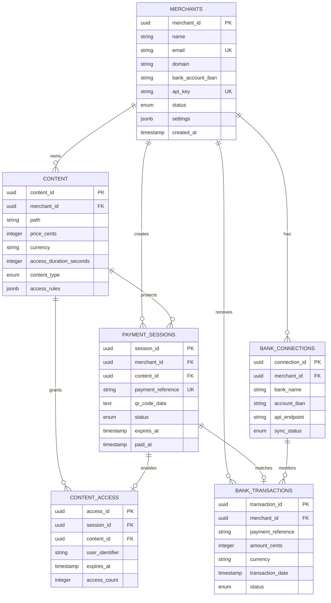

# Reverse Payment Proxy - Data Model

## Overview

This document defines the comprehensive data model for the Reverse Payment Proxy system, including all entities, relationships, and data flows required to support QR code-based SEPA payments and content delivery.

## Core Entities

### 1. Merchant

Represents content providers using the payment proxy service.

```sql
CREATE TABLE merchants (
    merchant_id UUID PRIMARY KEY DEFAULT gen_random_uuid(),
    name VARCHAR(255) NOT NULL,
    email VARCHAR(255) UNIQUE NOT NULL,
    domain VARCHAR(255) NOT NULL,
    bank_account_iban VARCHAR(34) NOT NULL,
    bank_account_bic VARCHAR(11),
    webhook_url VARCHAR(500),
    webhook_secret VARCHAR(255),
    api_key VARCHAR(255) UNIQUE NOT NULL,
    status merchant_status DEFAULT 'pending',
    pricing_tier VARCHAR(50) DEFAULT 'basic',
    created_at TIMESTAMPTZ DEFAULT NOW(),
    updated_at TIMESTAMPTZ DEFAULT NOW(),
    last_active_at TIMESTAMPTZ,
    settings JSONB DEFAULT '{}',
    metadata JSONB DEFAULT '{}'
);

CREATE TYPE merchant_status AS ENUM (
    'pending',
    'active', 
    'suspended',
    'deactivated'
);
```

**Key Fields:**
- `merchant_id`: Unique identifier for the merchant
- `domain`: Domain where the reverse proxy will operate
- `bank_account_iban`: SEPA-compatible bank account for receiving payments
- `webhook_url`: Endpoint for payment notifications
- `api_key`: Authentication for merchant API access
- `settings`: Configuration options (payment amounts, content rules, etc.)

### 2. Content

Defines protected content and access rules.

```sql
CREATE TABLE content (
    content_id UUID PRIMARY KEY DEFAULT gen_random_uuid(),
    merchant_id UUID REFERENCES merchants(merchant_id) ON DELETE CASCADE,
    path VARCHAR(1000) NOT NULL,
    title VARCHAR(255),
    description TEXT,
    price_cents INTEGER NOT NULL,
    currency VARCHAR(3) DEFAULT 'EUR',
    access_duration_seconds INTEGER DEFAULT 3600,
    content_type content_type_enum DEFAULT 'webpage',
    access_rules JSONB DEFAULT '{}',
    is_active BOOLEAN DEFAULT TRUE,
    created_at TIMESTAMPTZ DEFAULT NOW(),
    updated_at TIMESTAMPTZ DEFAULT NOW(),
    
    UNIQUE(merchant_id, path)
);

CREATE TYPE content_type_enum AS ENUM (
    'webpage',
    'api_endpoint',
    'file_download',
    'streaming_media',
    'subscription'
);
```

**Key Fields:**
- `path`: URL path pattern for protected content
- `price_cents`: Payment amount in cents (e.g., 250 = €2.50)
- `access_duration_seconds`: How long access remains valid after payment
- `access_rules`: Advanced rules for content access (IP restrictions, usage limits, etc.)

### 3. Payment Session

Tracks individual payment attempts and their lifecycle.

```sql
CREATE TABLE payment_sessions (
    session_id UUID PRIMARY KEY DEFAULT gen_random_uuid(),
    merchant_id UUID REFERENCES merchants(merchant_id) ON DELETE CASCADE,
    content_id UUID REFERENCES content(content_id) ON DELETE CASCADE,
    user_identifier VARCHAR(255), -- IP, user ID, or session cookie
    amount_cents INTEGER NOT NULL,
    currency VARCHAR(3) DEFAULT 'EUR',
    payment_reference VARCHAR(35) UNIQUE NOT NULL, -- SEPA payment reference
    qr_code_data TEXT NOT NULL,
    status payment_status DEFAULT 'pending',
    expires_at TIMESTAMPTZ NOT NULL,
    created_at TIMESTAMPTZ DEFAULT NOW(),
    paid_at TIMESTAMPTZ,
    access_granted_at TIMESTAMPTZ,
    access_expires_at TIMESTAMPTZ,
    user_agent TEXT,
    ip_address INET,
    metadata JSONB DEFAULT '{}'
);

CREATE TYPE payment_status AS ENUM (
    'pending',
    'paid',
    'expired',
    'cancelled',
    'failed',
    'refunded'
);
```

**Key Fields:**
- `payment_reference`: Unique SEPA reference for bank transaction matching
- `qr_code_data`: Complete QR code content (SEPA QR format)
- `expires_at`: When the payment session expires (typically 15 minutes)
- `access_expires_at`: When content access expires after payment

### 4. Bank Transaction

Records bank transactions detected through monitoring.

```sql
CREATE TABLE bank_transactions (
    transaction_id UUID PRIMARY KEY DEFAULT gen_random_uuid(),
    merchant_id UUID REFERENCES merchants(merchant_id),
    bank_reference VARCHAR(100),
    payment_reference VARCHAR(35),
    amount_cents INTEGER NOT NULL,
    currency VARCHAR(3) NOT NULL,
    debtor_name VARCHAR(255),
    debtor_iban VARCHAR(34),
    creditor_iban VARCHAR(34) NOT NULL,
    transaction_date TIMESTAMPTZ NOT NULL,
    booking_date TIMESTAMPTZ NOT NULL,
    value_date TIMESTAMPTZ,
    status transaction_status DEFAULT 'detected',
    processed_at TIMESTAMPTZ,
    raw_data JSONB,
    created_at TIMESTAMPTZ DEFAULT NOW()
);

CREATE TYPE transaction_status AS ENUM (
    'detected',
    'matched',
    'processed',
    'ignored',
    'disputed'
);
```

**Key Fields:**
- `payment_reference`: Links to payment_sessions table
- `bank_reference`: Bank's internal transaction ID
- `raw_data`: Complete bank API response for audit purposes

### 5. Content Access

Tracks granted access permissions and usage.

```sql
CREATE TABLE content_access (
    access_id UUID PRIMARY KEY DEFAULT gen_random_uuid(),
    session_id UUID REFERENCES payment_sessions(session_id) ON DELETE CASCADE,
    merchant_id UUID REFERENCES merchants(merchant_id) ON DELETE CASCADE,
    content_id UUID REFERENCES content(content_id) ON DELETE CASCADE,
    user_identifier VARCHAR(255) NOT NULL,
    granted_at TIMESTAMPTZ DEFAULT NOW(),
    expires_at TIMESTAMPTZ NOT NULL,
    last_accessed_at TIMESTAMPTZ,
    access_count INTEGER DEFAULT 0,
    ip_address INET,
    user_agent TEXT,
    is_active BOOLEAN DEFAULT TRUE
);
```

### 6. Bank Connection

Manages bank API connections and credentials.

```sql
CREATE TABLE bank_connections (
    connection_id UUID PRIMARY KEY DEFAULT gen_random_uuid(),
    merchant_id UUID REFERENCES merchants(merchant_id) ON DELETE CASCADE,
    bank_name VARCHAR(255) NOT NULL,
    bank_bic VARCHAR(11),
    account_iban VARCHAR(34) NOT NULL,
    api_endpoint VARCHAR(500) NOT NULL,
    client_id VARCHAR(255) NOT NULL,
    client_secret_encrypted TEXT NOT NULL, -- Encrypted storage
    access_token_encrypted TEXT,
    refresh_token_encrypted TEXT,
    token_expires_at TIMESTAMPTZ,
    last_sync_at TIMESTAMPTZ,
    sync_status sync_status_enum DEFAULT 'active',
    error_count INTEGER DEFAULT 0,
    last_error TEXT,
    created_at TIMESTAMPTZ DEFAULT NOW(),
    updated_at TIMESTAMPTZ DEFAULT NOW()
);

CREATE TYPE sync_status_enum AS ENUM (
    'active',
    'error',
    'disconnected',
    'rate_limited'
);
```

## Supporting Entities

### 7. Audit Log

Comprehensive logging for compliance and debugging.

```sql
CREATE TABLE audit_logs (
    log_id UUID PRIMARY KEY DEFAULT gen_random_uuid(),
    merchant_id UUID REFERENCES merchants(merchant_id),
    session_id UUID REFERENCES payment_sessions(session_id),
    event_type VARCHAR(50) NOT NULL,
    event_data JSONB NOT NULL,
    ip_address INET,
    user_agent TEXT,
    timestamp TIMESTAMPTZ DEFAULT NOW(),
    severity log_severity DEFAULT 'info'
);

CREATE TYPE log_severity AS ENUM ('debug', 'info', 'warning', 'error', 'critical');

-- Indexes for performance
CREATE INDEX idx_audit_logs_merchant_timestamp ON audit_logs(merchant_id, timestamp);
CREATE INDEX idx_audit_logs_event_type ON audit_logs(event_type);
CREATE INDEX idx_audit_logs_session_id ON audit_logs(session_id);
```

### 8. System Configuration

Global system settings and feature flags.

```sql
CREATE TABLE system_config (
    config_key VARCHAR(100) PRIMARY KEY,
    config_value JSONB NOT NULL,
    description TEXT,
    is_sensitive BOOLEAN DEFAULT FALSE,
    updated_at TIMESTAMPTZ DEFAULT NOW(),
    updated_by VARCHAR(255)
);
```

## Data Relationships

### Entity Relationship Diagram



## Data Flow Patterns

### 1. Payment Flow

```
1. User Request → Content Check → Payment Session Creation
2. Payment Session → QR Code Generation → User Display
3. User Payment → Bank Transaction → Transaction Detection
4. Transaction Match → Payment Session Update → Access Grant
5. Access Grant → Content Delivery
```

### 2. Bank Monitoring Flow

```
1. Scheduled Sync → Bank API Call → Transaction Fetch
2. Transaction Processing → Reference Matching → Session Update
3. Session Update → Webhook Notification → Access Grant
4. Audit Logging → Error Handling → Status Update
```

## Data Validation Rules

### Business Rules

1. **Payment Reference Uniqueness**: Each payment reference must be unique across all active sessions
2. **Session Expiry**: Payment sessions expire after 15 minutes if unpaid
3. **Access Duration**: Content access expires based on content configuration
4. **Amount Validation**: Payment amounts must match exactly (including cents)
5. **Currency Consistency**: All transactions within a session use the same currency

### Data Integrity Constraints

```sql
-- Ensure payment amounts are positive
ALTER TABLE content ADD CONSTRAINT check_price_positive 
    CHECK (price_cents > 0);

ALTER TABLE payment_sessions ADD CONSTRAINT check_amount_positive 
    CHECK (amount_cents > 0);

-- Ensure valid IBAN format
ALTER TABLE merchants ADD CONSTRAINT check_iban_format 
    CHECK (bank_account_iban ~ '^[A-Z]{2}[0-9]{2}[A-Z0-9]{4}[0-9]{7}([A-Z0-9]?){0,16}$');

-- Ensure session expiry is in the future
ALTER TABLE payment_sessions ADD CONSTRAINT check_expires_future 
    CHECK (expires_at > created_at);

-- Ensure access expiry is after grant time
ALTER TABLE content_access ADD CONSTRAINT check_access_expires_future 
    CHECK (expires_at > granted_at);
```

## Performance Considerations

### Indexing Strategy

```sql
-- Primary lookup indexes
CREATE INDEX idx_payment_sessions_reference ON payment_sessions(payment_reference);
CREATE INDEX idx_payment_sessions_status_expires ON payment_sessions(status, expires_at);
CREATE INDEX idx_content_merchant_path ON content(merchant_id, path);
CREATE INDEX idx_content_access_user_expires ON content_access(user_identifier, expires_at);
CREATE INDEX idx_bank_transactions_reference ON bank_transactions(payment_reference);
CREATE INDEX idx_bank_transactions_merchant_date ON bank_transactions(merchant_id, transaction_date);

-- Composite indexes for common queries
CREATE INDEX idx_payment_sessions_merchant_status ON payment_sessions(merchant_id, status);
CREATE INDEX idx_content_access_active ON content_access(is_active, expires_at) WHERE is_active = true;
```

### Data Partitioning

For high-volume deployments, consider partitioning by time:

```sql
-- Partition payment sessions by month
CREATE TABLE payment_sessions_y2024m01 PARTITION OF payment_sessions
    FOR VALUES FROM ('2024-01-01') TO ('2024-02-01');

-- Partition audit logs by quarter
CREATE TABLE audit_logs_2024q1 PARTITION OF audit_logs
    FOR VALUES FROM ('2024-01-01') TO ('2024-04-01');
```

## Security Considerations

### Data Encryption

1. **Sensitive Fields**: Bank API credentials, webhook secrets
2. **PII Protection**: User identifiers, IP addresses (GDPR compliance)
3. **Payment Data**: Transaction details, payment references

### Access Control

```sql
-- Row-level security for multi-tenant data
ALTER TABLE payment_sessions ENABLE ROW LEVEL SECURITY;
ALTER TABLE content ENABLE ROW LEVEL SECURITY;
ALTER TABLE content_access ENABLE ROW LEVEL SECURITY;

-- Policies for merchant data isolation
CREATE POLICY merchant_isolation_payments ON payment_sessions
    USING (merchant_id = current_setting('app.current_merchant_id')::uuid);

CREATE POLICY merchant_isolation_content ON content
    USING (merchant_id = current_setting('app.current_merchant_id')::uuid);
```

## Data Retention Policies

### Retention Schedule

- **Active Sessions**: Keep until access expires + 30 days
- **Completed Payments**: 7 years (financial regulation compliance)
- **Audit Logs**: 3 years for compliance, 1 year for operational logs
- **Bank Transactions**: 7 years (regulatory requirement)
- **User Access Data**: 2 years or until user requests deletion (GDPR)

### Automated Cleanup

```sql
-- Cleanup expired sessions
DELETE FROM payment_sessions 
WHERE status = 'expired' 
AND expires_at < NOW() - INTERVAL '30 days';

-- Archive old audit logs
INSERT INTO audit_logs_archive 
SELECT * FROM audit_logs 
WHERE timestamp < NOW() - INTERVAL '1 year';

DELETE FROM audit_logs 
WHERE timestamp < NOW() - INTERVAL '1 year';
```

This data model provides a comprehensive foundation for the reverse payment proxy system, ensuring data integrity, performance, and compliance with financial and privacy regulations.